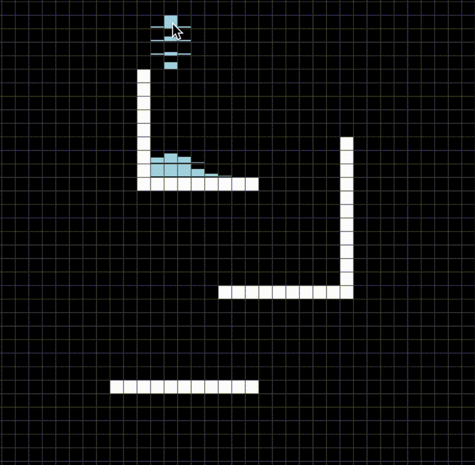

# Fluid simulator with cellular automaton

Implementation of 2d liquid simulator



```shell
$ make
$ ./main
```

Much referenced these simulators
[Liquid-Simulator](https://www.jgallant.com/2d-liquid-simulator-with-cellular-automaton-in-unity/)
[Fluid-Simulator](https://w-shadow.com/blog/2009/09/01/simple-fluid-simulation/)
